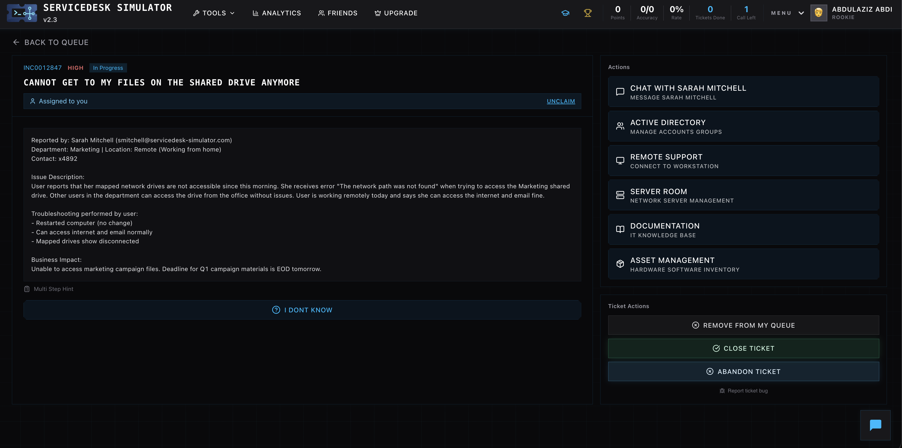
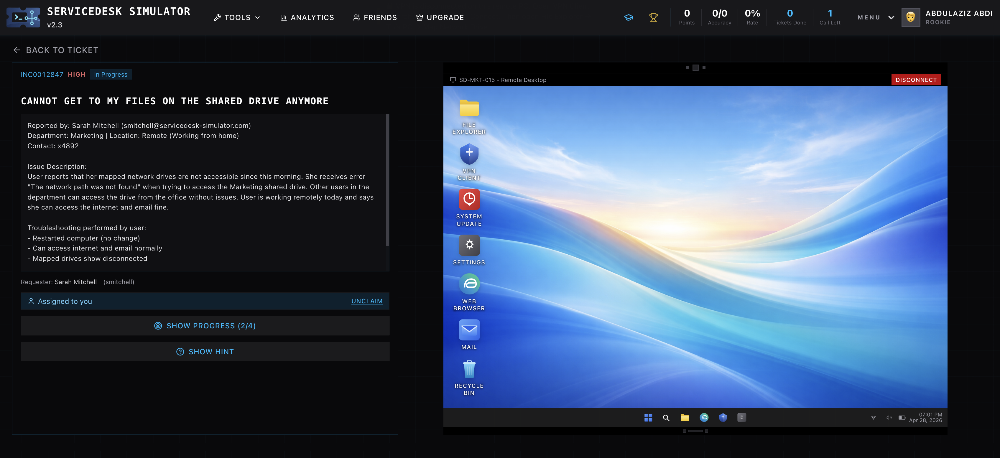
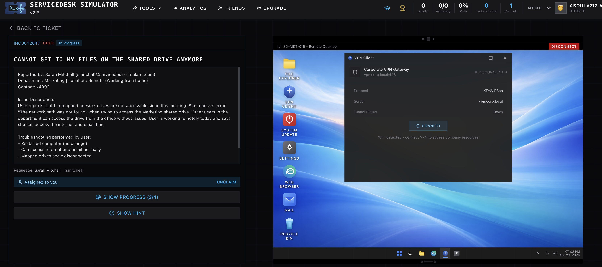
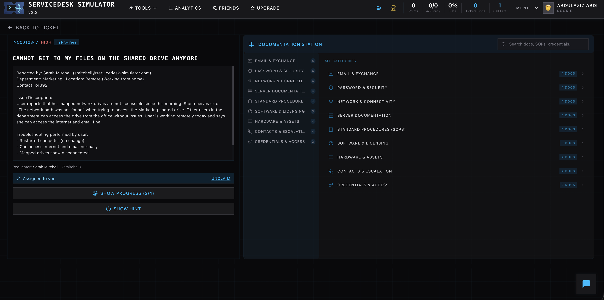
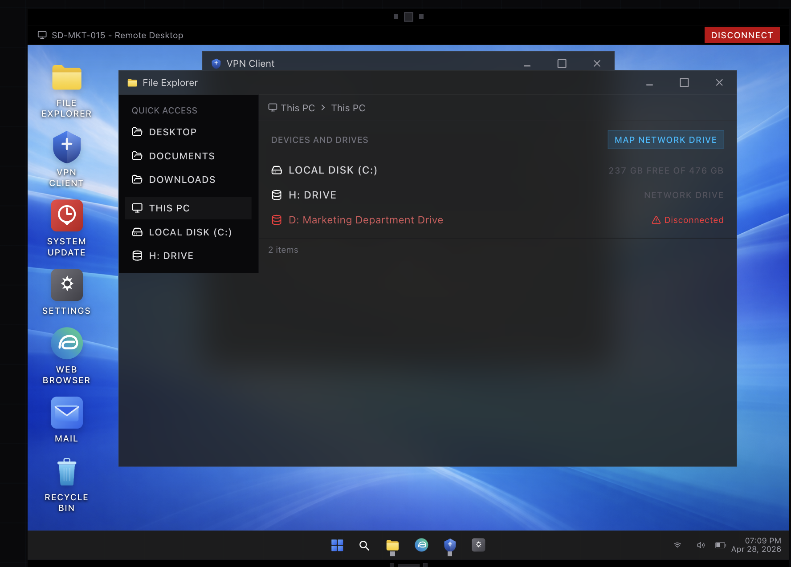
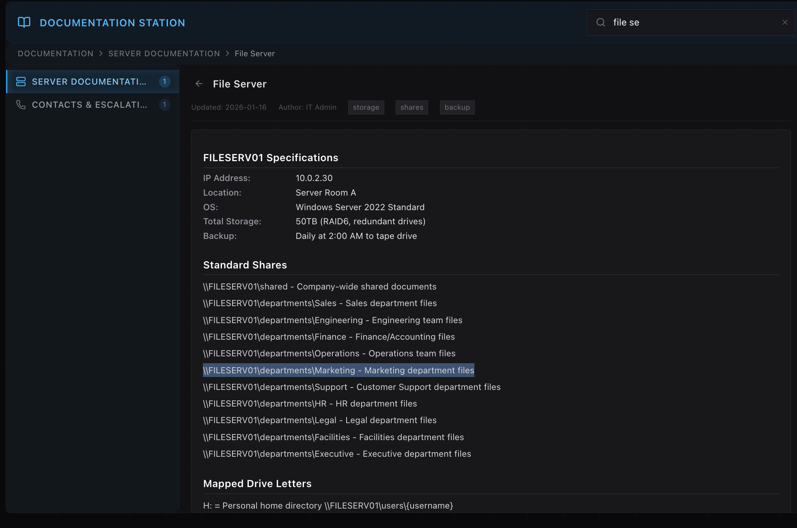
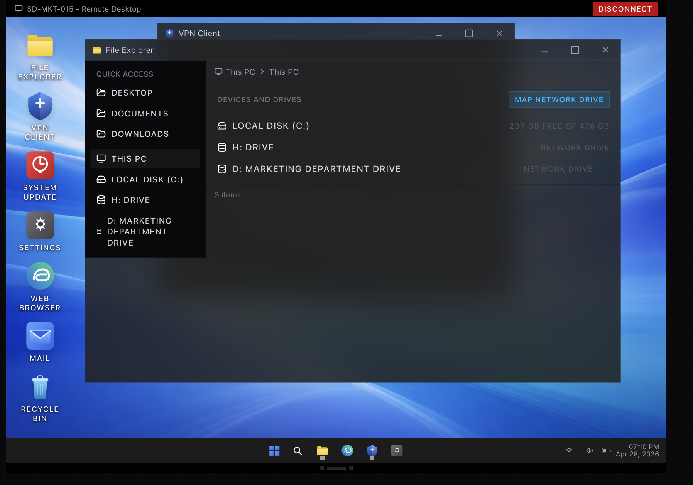
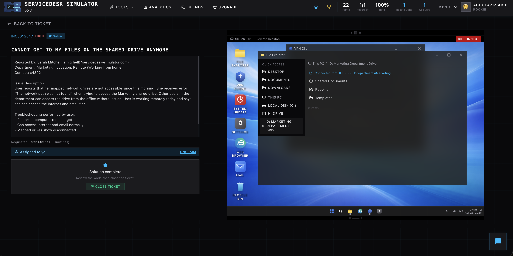

# 🎫 Ticket 001 — Cannot Access Shared Drive (VPN Issue)

## 📌 Issue
User cannot access shared network drive while working remotely.

**Error:**  
"The network path was not found"

---

## 🧠 Analysis

- User working remotely (WFH)
- Internet and email working fine
- Other users not affected
- Mapped drive shows disconnected

👉 Likely cause: **User not connected to VPN**

---

## 🛠️ Troubleshooting Steps

### Step 1 — Review Ticket
User reports issue accessing shared drive.

---

### Step 2 — Start Remote Support Session
Connected to user's machine.
*(optional if you want to mention it, no screenshot needed if not clear)*

---

### Step 3 — Check VPN Status
VPN is disconnected.

---

### Step 4 — Connect to VPN
User connects to corporate VPN.

---

### Step 5 — Locate File Server Path
Used documentation to find correct UNC path:

---

### Step 6 — Verify Existing Drive Issue
Mapped drive is currently disconnected.

---

### Step 7 — Map Network Drive
Mapped drive using correct UNC path.

---

### Step 8 — Confirm Drive Access
Drive is now connected and files are accessible.

---

### Step 9 — Close Ticket
Issue resolved and ticket closed.

---

## ✅ Resolution
Connected user to VPN and remapped the network drive successfully.

---

## 🔍 Root Cause
User was not connected to VPN, preventing access to internal file server.

---

## 💡 Skills Demonstrated

- VPN troubleshooting
- Network drive mapping
- Remote support workflow
- Documentation usage
- Root cause analysis
- End-user support
